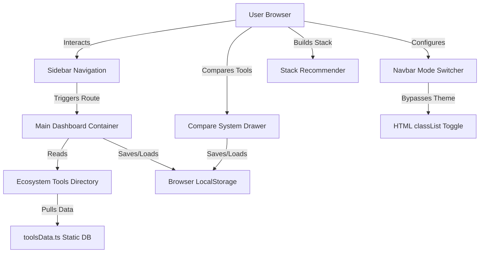
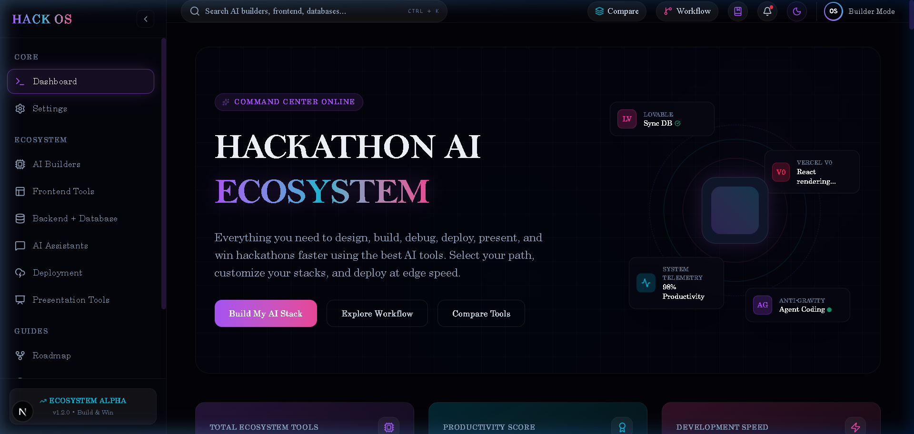
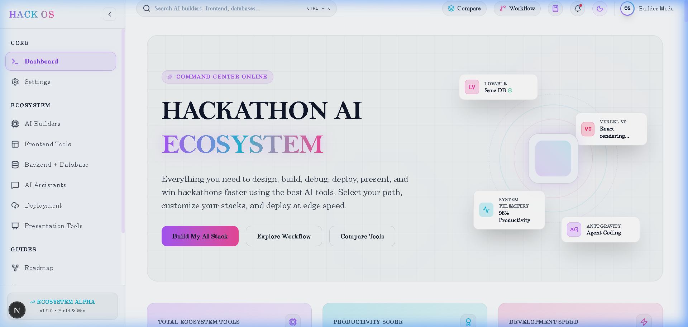

# Hack OS AI Ecosystem — The Ultimate Hackathon Developer Command Center

Welcome to **Hack OS AI Ecosystem**, a next-generation developer dashboard designed to accelerate hackathon building. Hack OS organizes, filters, compares, and recommends the best AI builders, frontend, backend, database, and presentation tools in a sleek, glassmorphic command center. Features include a dynamic countdown timer, custom tech-stack recommendation wizard, side-by-side comparison system, and robust dark/light modes.

---

## 🚀 How It Works
1. **Explore the Ecosystem**: Navigate through curated categories like AI Builders, Frontend Tools, and AI Assistants.
2. **Filter & Sort**: Instantly search tools by name, categorize by tech layer, filter by difficulty (No-Code to Hard-Code), and sort by productivity or speed.
3. **Compare Side-by-Side**: Select up to 3 tools to compare stats, use cases, pros, cons, and performance scores.
4. **Build Stacks**: Use the **Stack Recommender** to select your hackathon track (e.g., SaaS, Web3, Mobile) and receive an instant, optimized AI-powered tech stack suggestion.
5. **Track Progress**: Set your hackathon deadline in the interactive countdown timer widget.

---

## 🛠️ Architecture

### 1. Front-End (UI/UX)
* **Framework**: React 19 & Next.js 16.
* **Styling**: Tailwind CSS v4 with custom neon variables and premium glassmorphism.
* **Animations**: Framer Motion for smooth page navigations, toggle effects, and floating asset loops.
* **Icons**: Lucide React.

### 2. Middle-End (State & Logic)
* **Client-Side Storage**: React state synced automatically with `localStorage` to persist favorites, compared lists, and light/dark theme preferences.
* **Filtering Engine**: Instant search query parsing and sorting algorithms.

### 3. Back-End (Data Model)
* **Static Database**: Structurally defined in `toolsData.ts`, containing detailed profiles, pros/cons, productivity scores, and tags for AI tools.

---

## 📊 System Architecture Flow Chart

---

## 🤖 Agents & Tools Used
* **Next.js Webpack Compilation**: Bypasses system path formatting issues to ensure lightning-fast dev builds.
* **Local Storage Sync**: Keeps favorite lists, comparisons, and settings persistent without requiring database authentication.
* **Tailwind CSS v4 Variables**: Supports instant color-swapping between Dark (Futuristic Neon) and Light (High-Contrast Glassmorphism) modes.

---

## 📸 Screenshots

### Dark Mode

### Light Mode

---

## 💖 Conclusion
Hack OS is built by developers, for developers, to take the friction out of building MVP prototypes. By bringing together the best AI development tools into a single, high-contrast, fully readable command center, it allows you to focus on what matters most: shipping high-quality code and winning hackathons.

Thank you so much for visiting my GitHub account and checking out this repository! If this command center helped you, feel free to star the repository, fork it to build your own dashboard, or reach out. Happy hacking! 🚀
